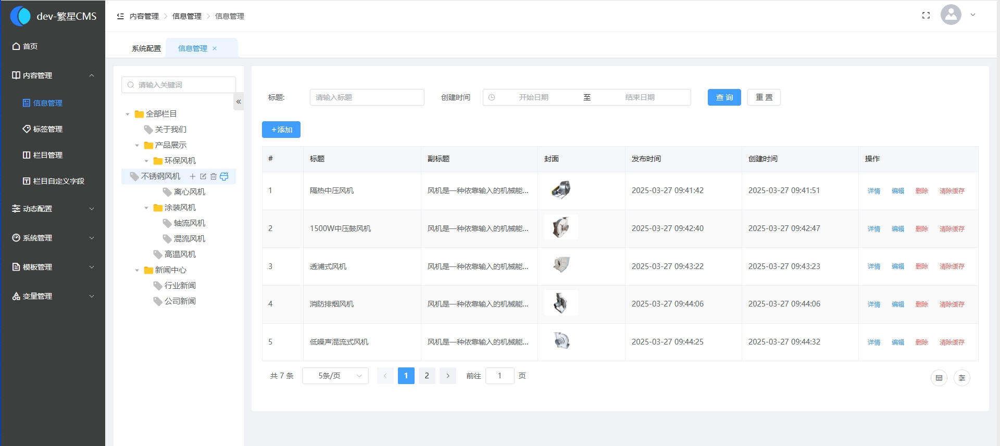

# 繁星 cms 开源版 v3.0.2

## 主要特点

- 繁星 cms 开源版完全免费使用
- cms 系统界面简洁，操作简单
- 繁星 cms 系统界面简洁，操作简单
- 采用 php、mysql 组合，快速、低成本
- 使用 vue3、element plus 最新前端技术栈
- 合理的目录、功能划分，便于二次开发
- 页面标签采用 thinkphp 内置标签系统，无需额外学习其他 cms 标签，上手学习成本低
- 长期迭代升级维护，使用有保障

## 面向对象

- 企 业：帮助创立初期的公司或团队快速搭建企业官网；
- 开发者：帮助开发者快速完成承接外包的项目，避免从零搭建系统；
- 学习者：初学编程的同学可以下载源代码来进行学习交流；

## 我们还有繁星 cms 商业版

### 功能全面，更适合企业使用

- 内置更多内容模型，新闻模型、图片模型、下载模型，让内容设置更专业多样。
- html 文件模板，让页面模板开发更便捷。
- 完备的权限管理让人员角色管理更容易。
- 提供轮播图、用户留言运营管理功能。
- 动态系统配置，让版权、联系电话、地址等信息更新更便捷。

### 商业版体验地址：

[https://case.vip.linyuankj.cn/admsystem](https://case.vip.linyuankj.cn/admsystem)

- 账号：stars
- 密码：88888888

## 繁星 cms 开源版软件截图

## 技术选型

#### 后端框架

| 技术     | 名称                                      | 官网                                                                     |
| -------- | ----------------------------------------- | ------------------------------------------------------------------------ |
| php      | 开源服务器端脚本语言，尤其适用于 Web 开发 | https://www.php.net/                                                     |
| thinkphp | 免费开源，基于 php 语言的后端开发框架     | https://www.kancloud.cn/manual/thinkphp6_0/1037479                       |
| mysql    | 免费开源数据库                            | https://www.mysql.com/                                                   |
| redis    | 免费开源分布式缓存数据库                  | [https://redis.io](https://gitee.com/link?target=https%3A%2F%2Fredis.io) |

#### 前端框架

| 技术         | 名称      | 官网                                                                                         |
| ------------ | --------- | -------------------------------------------------------------------------------------------- |
| Vue 3 全家桶 | MVVM 框架 | [https://cn.vuejs.org//](https://gitee.com/link?target=https%3A%2F%2Fcn.vuejs.org%2F)        |
| Element Plus | UI 库     | [https://element-plus.org/](https://gitee.com/link?target=https%3A%2F%2Felement-plus.org%2F) |

## 文档

繁星 cms 文档整理中，敬请期待

## 代码目录结构

#### 后端工程&&前端工程

  
  

## 开发环境

建议开发者使用以下环境，避免带来运行失败问题

- Windows、Linux
- vscode、PhpStorm
- Mysql≧5.5.62
- php7.4
- nodejs v16.15.1 左右

## 合作与技术支持联系

- 联系邮箱： 1465768310@qq.com
- 工作微信：
<table>
	<tbody>
    <tr>
      <td width="25%"></td>
    </tr>
  </tbody>
</table>

添加微信请备注来意，谨防忽略陌生人

## 捐赠打赏

感谢各位大佬的支持，如果本项目对您等开发、学习带来帮助，感谢打赏本项目，让我们有精力持续更加完善项目。您的支持，是我们一直坚持下来的动力。

<table>
	<tbody>
    <tr>
      <td width="33.33%"></td>
      <td width="33.33%"></td>
    </tr>
  </tbody>
</table>

## 版权信息

繁星 cms 遵循 Apache2 开源协议发布，并提供免费使用。

本项目包含的第三方源码和二进制文件之版权信息另行标注。

版权所有 Copyright © 2025 by 繁星 cms

All rights reserved。
